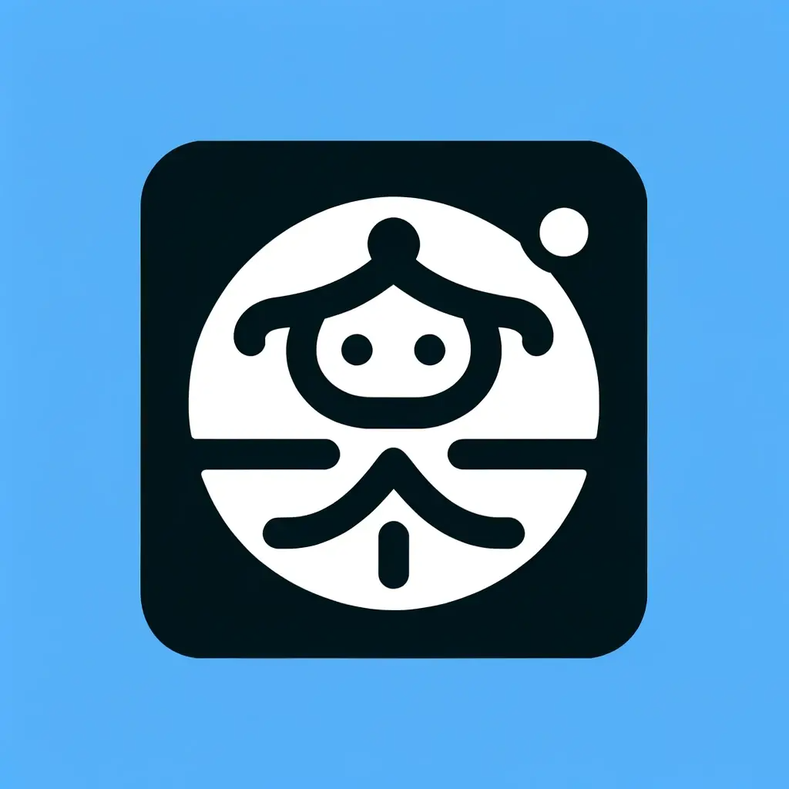

# Knocks

https://github.com/knocks-public

---

## Introduction

**Inro**: Zero-Knowledge Proof Age Verification System.
Proving age without compromising personal information

---

## Problem Statement

Age checks often reveal too much personal information like your name, address, and photo. This harms your privacy and raises the risk of data theft.

---

## Innovative Solutions

Show a QR code on your smartphone instead of an ID. That's it. No extra devices needed. Zero-knowledge proofs confirm age without revealing personal details.

---

## How It Works

- **For Users**:
  1. **Scan ID**: Users scan their ID using the Inro app.
  2. **Generate QR Code**: The app generates a QR code that proves their age.

- **For Verifiers**:
  1. **Scan QR Code**: Verifiers scan the user's QR code.
  2. **Confirm Age**: They confirm the user's age without seeing other personal details.

---

## System Overview

---

## Slide 5: Technology Stack

**Title**: Leveraging Advanced Technologies

---

## Use Cases

**Title**: Transforming Digital Identity Verification

---

## Slide 7: Benefits

**Title**: Why Choose Inro

---

## Slide 8: Future Prospects

**Title**: Expanding Horizons

---

## Team

<table>
  <tr>
    <td>
      
       
      <b><a href="https://susumutomita.netlify.app/">Susumu Tomita</a></b>
       
      Co-Founder
       
      Software Engineer
    </td>
    <td>
      
       
      <b>Shingo Takagi</b>
       
      Co-Founder
       
      Software Engineer
    </td>
  </tr>
</table>

---

## Slide 10: Call to Action

**Title**: Join Us in Revolutionizing ID Verification

---

## Collaborations

**Title**: Join Us in Revolutionizing ID Verification

---

## Thank you

for your time and attention.
